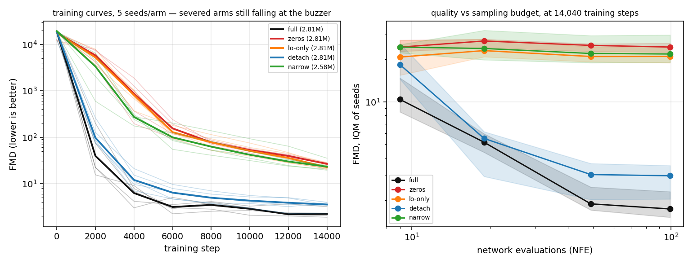
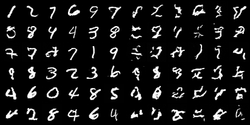

# napkin-skips

**Do a UNet's skip connections earn their keep?**

Every diffusion tutorial draws the UNet with its long horizontal arrows and every one of
them says the arrows "preserve high-frequency detail". Almost none of them ablate the
arrows. This repo does — a straight leave-one-out at **2.8M parameters** on MNIST, holding
data, sampler, NFE axis and metric identical to
[napkin-diffusion](https://github.com/arose26/napkin-diffusion). This file *is* that file
plus an arm knob, which is the point: nothing else moved.

## The naming trap, first

`ResBlock.skip` in the source is the 1×1 residual projection **inside** every block. It is
**not** what is ablated here. The subject is the three `torch.cat` arrows from encoder to
decoder. **Every arm keeps every residual connection.** "A denoiser with no skips" would be
a different and much sicker network than anything in this grid.

## The five arms

Only `narrow` changes the parameter count. The rest are shape- and param-matched — the
control-arm discipline [napkin-gamemaster](https://github.com/arose26/napkin-gamemaster)
learned the hard way when its `no-stack` arm turned out to change two variables at once.

| arm | the arrow becomes | params | isolates |
|---|---|---|---|
| `full` | `cat([up(u), h_k])` | 2.813M | the textbook UNet — control |
| `zeros` | `cat([up(u), 0*h_k])` | 2.813M | the arrows, with `narrow`'s parameter loss controlled |
| `lo-only` | `h3` live, `h1`/`h2` zeroed | 2.813M | is it only the low-res arrow that matters? |
| `detach` | `cat([up(u), h_k.detach()])` | 2.813M | **gradient path** vs feature path |
| `narrow` | no `cat` at all | 2.576M | the plain encoder–decoder CNN |

`zeros` is the arm the headline claim rests on, and it is worth being precise about what it
does and does not control. It has `full`'s exact parameter count, tensor shapes and FLOPs, so
it rules out the specific confound `narrow` introduces: *"the skip-free model is worse merely
because it lost 237,216 parameters and three residual projections."*

It does **not** establish an "information, not capacity" dichotomy, and an earlier draft of
this README claimed that it did. A zeroed arrow feeds constant zero to the decoder's skip-side
input channels, so the weights reading them are dead — `zeros` has `full`'s parameter count and
something close to `narrow`'s *effective* capacity. That is a feature of the design, not a
flaw: `zeros` and `narrow` should behave alike, and if they do, the parameter deficit was not
what mattered. But this grid cannot separate "the arrows carry information the decoder needs"
from "the arrows give the decoder usable capacity" — those are two descriptions of the same
severed pathway, and no arm here pulls them apart.

`narrow` is deliberately *not* the control, because halving a decoder block's input width
from 2c to c removes three things, not one — and the third is easy to miss. `ResBlock`
projects its residual with a 1×1 conv only when `cin != cout`, so at `cin == cout` that
projection becomes an `Identity` and vanishes. `narrow` therefore also loses three 1×1
convs and some GroupNorm affines: **237,216 parameters**, a number `selfcheck` derives from
the layer shapes rather than reading off the model.

## Registered hypothesis

Written before the grid ran; `git log` on this file is the timestamp.

The tempting information-theoretic argument says the skips should be *unnecessary* here:
the 8×8×128 bottleneck holds 8,192 values against a 1,024-pixel output, so it is not a
capacity bottleneck at all. I predict that argument is wrong, because the bottleneck is a
*spatial* one — a 4× downsample destroys the pixel-accurate alignment that ε-prediction
needs at low noise, and no count of channels at 8px restores it.

1. **`zeros` is decisively worse than `full`** — at least 2× the FMD at 100 NFE. The skips
   are load-bearing.
2. **`lo-only` lands nearer `zeros` than `full`.** The 8px arrow is at the *same resolution*
   as the mid block, so it is close to a plain residual around three blocks; the useful
   arrows should be `h1`/`h2`, the ones that restore resolution.
3. **`detach` ≈ `full`.** The value is the forward feature path, not the gradient shortcut.
   At 2.8M parameters and 14k steps there is no vanishing-gradient problem for a shortcut
   to solve.
4. **`narrow` ≈ `zeros`.** Its 8% parameter deficit should be second-order next to losing
   the arrows. If `narrow` is much worse than `zeros`, capacity mattered too, and claim 1's
   attribution needs the `zeros` arm to survive on its own.

Prediction 1 is the one worth being wrong about. Predictions 2–4 are mechanism claims, and
any of them failing is more interesting than all of them holding.

## Results


`full | detach | lo-only | narrow | zeros`, same sampler, same seed, same noise. Two of these
make digits.



5 arms × 5 seeds × 14,040 training steps. FMD over 10,000 samples against the full MNIST test
set, Heun on Karras spacing. **IQM with a 95% percentile bootstrap CI**, hand-rolled.

| arm | NFE 9 | NFE 19 | NFE 49 | **NFE 99** | 9→99 |
|---|---|---|---|---|---|
| `full` | 10.41 | 5.17 | 1.89 | **1.74** <sub>[1.52, 2.31]</sub> | **6.0×** |
| `detach` | 18.40 | 5.50 | 3.05 | **2.99** <sub>[2.05, 3.54]</sub> | **6.2×** |
| `lo-only` | 20.78 | 23.08 | 20.97 | **20.99** <sub>[18.93, 24.64]</sub> | 0.99× |
| `narrow` | 24.45 | 23.90 | 22.03 | **21.84** <sub>[19.07, 29.81]</sub> | 1.12× |
| `zeros` | 24.43 | 27.01 | 25.14 | **24.47** <sub>[22.49, 26.07]</sub> | 1.00× |

### The four registered predictions

**1. `zeros` decisively worse than `full` — CONFIRMED, by far more than predicted.** 14×, with
CIs nowhere near touching, against a registered "at least 2×". `zeros` has `full`'s exact
parameter count, shapes and FLOPs, so this is not the 237,216 parameters `narrow` loses.

**2. `lo-only` lands nearer `zeros` than `full` — CONFIRMED.** `lo-only` [18.93, 24.64]
overlaps `zeros` [22.49, 26.07] and is nowhere near `full`. Turning the 8px arrow back on is
the *only* difference between those two arms, and it buys nothing measurable. The load-bearing
arrows are `h1` (32px) and `h2` (16px) — the ones that restore resolution.

**3. `detach` ≈ `full` — upheld where it matters, unresolved where it doesn't.** `detach` 2.99
[2.05, 3.54] against `full` 1.74 [1.52, 2.31]. The CIs overlap slightly, so I cannot claim
`detach` is worse; but 4 of 5 `detach` seeds sit above 4 of 5 `full` seeds, so I cannot claim
they are equal either. What *is* solid is the thing the prediction was about: removing the
gradient shortcut while keeping the forward feature path leaves the model ~7× better than the
best severed arm, firmly in `full`'s regime. The skips earn their keep by carrying features
forward, not by shortening the gradient path.

**4. `narrow` ≈ `zeros` — CONFIRMED.** `narrow` [19.07, 29.81] overlaps `zeros` [22.49, 26.07].
Those 237,216 parameters and three residual projections buy nothing measurable — which is what
retroactively justifies resting the headline on `zeros` instead of `narrow`.

### An unregistered finding, and the correction it needed

At this budget the three severed arms are **insensitive to sampling budget** — 0.99×, 1.00×
and 1.12× going from 9 to 99 network evaluations, against 6.0× and 6.2× for the intact arms.
So the gap *grows* with sampling compute:

```
at  9 NFE:  full 10.41  vs  zeros 24.43   ->  2.3x
at 99 NFE:  full  1.74  vs  zeros 24.47   -> 14.1x
```

I first wrote this up as "the skips buy quality that sampling compute cannot", which is
**wrong**, and the long `narrow` run refutes it. Trained 4× longer, the *same* skip-free
architecture responds to NFE steeply:

| `narrow` | NFE 9 | NFE 19 | NFE 49 | NFE 99 | 9→99 |
|---|---|---|---|---|---|
| @14,040 steps | 24.45 | 23.90 | 22.03 | 21.84 | 1.12× |
| @56,160 steps | **8.68** | **2.64** | **1.15** | **1.24** | **6.98×** |

That is a steeper response than `full` manages at the grid budget (5.98×), from a checkpoint
with no encoder–decoder arrows at all — and at 1.24 it beats `full`'s own 99-NFE IQM of 1.74.

The mechanism was right, the attribution was not. FMD collects sampler discretisation error
and model error, and NFE reduces only the first; when a model's own error dominates, the
second is invisible. That is a statement about **training state**, not topology. Removing the
skips does not confer NFE-insensitivity — it puts the model further from convergence at any
given step count, and that does.

What survives is the trap for anyone comparing ablations at a shared budget: the headline
ratio has *two* hidden parameters, training steps and inference compute, and they move it
severalfold in opposite directions. See INSIGHTS #8.

### Budget dependence, stated once more

Every number above is at 14,040 steps, and the severed arms are **not converged there** — the
45-epoch probe shows `narrow` still falling at 21,060 steps. These ratios are budget-dependent
slices, not ceiling ratios. See the convergence probe below.

## The convergence probe, and the question it left open

The grid's budget was not inherited. Before it ran, one `full` and one `narrow` were trained to
45 epochs (21,060 steps) with FMD sampled every 1,000, to check that 30 epochs cleared every
arm's onset:

| step | 3k | 6k | 9k | 12k | 14k | 17k | 21k |
|---|---|---|---|---|---|---|---|
| `full` | 4.14 | 1.77 | 2.07 | 1.39 | 1.50 | 1.26 | 1.10 |
| `narrow` | 133 | 73.3 | 43.4 | 28.3 | 22.3 | 16.4 | 10.9 |

`full` saturates around 11k steps; `narrow` was still falling at 21k. One arm converged and the
other did not, which is why the ratio moves with the budget — 14.9× at 30 epochs, 9.9× at 45 —
and why this repo reports curves rather than a single number.



That left one question open, and I declined to guess it: a still-descending curve can asymptote
anywhere, so "`narrow` has not saturated" was never "`narrow` will catch up".

### Resolved: the gap is overwhelmingly convergence speed

This was the repo's open question, and I refused to guess it: a still-descending curve can
asymptote anywhere, so "`narrow` has not saturated" was never "`narrow` will catch up". Both
arms were run at **56,160 steps** — 4× the grid budget, same machine, same seed 98 — and swept
on the grid's own metric (10,000 samples).

| arm @56,160 steps | NFE 9 | NFE 19 | NFE 49 | NFE 99 | 9→99 |
|---|---|---|---|---|---|
| `full` | 11.88 | 3.33 | **0.90** | **0.77** | 15.5× |
| `narrow` | **8.68** | **2.64** | 1.15 | 1.24 | 7.0× |

```
at the 14,040-step grid budget, 99 NFE:  full 1.74  vs  narrow 21.84   ->  12.6x
at 56,160 steps,                99 NFE:  full 0.77  vs  narrow  1.24   ->   1.63x
```

**The 12.6× headline collapses to 1.63× once both arms are trained to convergence.** That is
the finding: the cost of removing the encoder–decoder arrows at this scale is overwhelmingly a
*convergence-speed* penalty, not an attainable-quality one.

**What I deliberately do not claim.** It is tempting to read the surviving 1.63× as "a real
residual quality gap". At n=1 per arm that does not follow. In the five-seed grid, `full`'s own
seeds spanned 1.49–2.48 at 99 NFE (a 1.66× ratio) and `narrow`'s spanned 18.58–33.24 (1.79×) —
**both arms individually vary by more than the cross-arm gap being measured.** So whether any
residual difference exists is *unresolved*, and settling it needs ~5 seeds per arm at the long
budget, not one.

Two further caveats point the same way. `full` is flat in 0.96–1.27 from about 24k steps, while
`narrow` was **still descending** at 56k (1.87 → 1.68 over its last two probes) — so `narrow`'s
number is an upper bound and more training would shrink the remaining gap, not grow it. And a
low-NFE crossover appears: at 9 and 19 NFE `narrow` is *better* (0.73× and 0.79×). Converged
`full` is also worse at 9 NFE than the 14k-step `full` was (11.88 vs 10.41), which is familiar
diffusion behaviour — a sharper, better-converged model carries larger discretisation error at
very few steps. Plausible rather than anomalous, and logged as an observation to test at n>1.

## What this does *not* show

It is tempting to read this repo as "why a UNet beats a transformer at small scale". It
cannot say that. A UNet-vs-DiT comparison is a separate, unfinished experiment
([napkin-dit](https://github.com/arose26/napkin-dit)), and until it produces a result there
is no measured win here for skips to explain. If that comparison does land UNet-first, this
grid is a *candidate mechanism* for it — nothing more.

Scale caveat, stated once: every number here is at 2.8M parameters on 32×32 grayscale
digits. Skips plausibly matter less as the bottleneck widens and more as resolution grows,
and this repo measures one point, not a trend.

## Running it

```bash
python3 napkin_skips.py selfcheck
```

```bash
python3 napkin_skips.py grid --seeds 5
```

```bash
python3 napkin_skips.py sweep --seeds 5 && python3 napkin_skips.py report
```

Needs `torch`, `torchvision`, `matplotlib`, `imageio`, and `numpy<2` (torch 2.x wheels are
built against the numpy-1 ABI). `out/` is gitignored; every published number has its own
JSON under `assets/`.

## Metric

**FMD**, not FID: a Fréchet distance in the feature space of a small MNIST CNN, inherited
unchanged from napkin-diffusion. Comparable *within* this repo only — never against a
published FID. Inception features on upscaled grayscale digits look authoritative and mean
very little, so this repo does not pretend otherwise.
